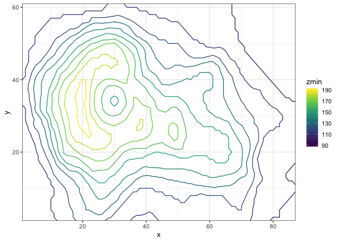
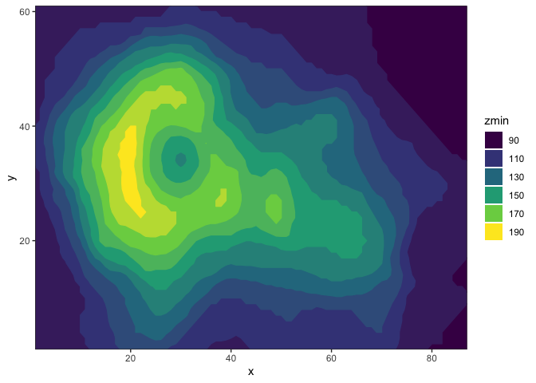
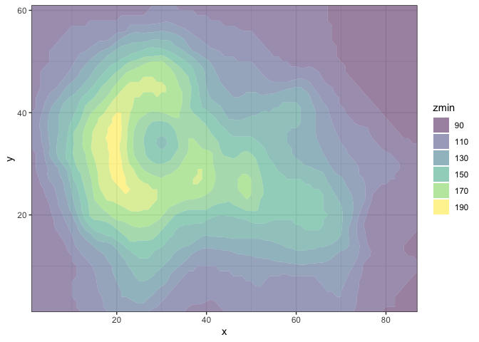
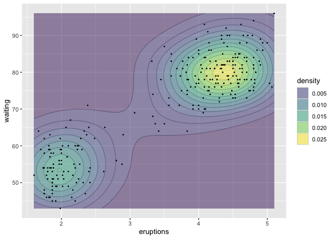

<!-- README.md is generated from README.Rmd. Please edit that file -->

# ggisoband

This package provides a ggplot2 interface to the isoband library which
can generate contour lines (isolines) and contour polygons (isobands)
from regularly spaced grids containing elevation data.

## Installation

Install from github with:

``` r
devtools::install_github("clauswilke/ggisoband")
```

## Examples

We can draw contour lines and contour bands, including partially
transparent contour lines.

``` r
library(ggplot2)
library(ggisoband)

volcano3d <- reshape2::melt(volcano)
names(volcano3d) <- c("x", "y", "z")

ggplot(volcano3d, aes(x, y, z = z)) +
  geom_isobands(aes(color = stat(zmin)), fill = NA) +
  scale_color_viridis_c() +
  coord_cartesian(expand = FALSE) +
  theme_bw()
```



``` r

ggplot(volcano3d, aes(x, y, z = z)) +
  geom_isobands(aes(fill = stat(zmin)), color = NA) +
  scale_fill_viridis_c(guide = "legend") +
  coord_cartesian(expand = FALSE) +
  theme_bw()
```



``` r

# set polygon_outline = FALSE when drawing filled polygons
# with alpha transparency
ggplot(volcano3d, aes(x, y, z = z)) +
  geom_isobands(
    aes(fill = stat(zmin)), color = NA,
    alpha = 0.5, polygon_outline = FALSE
  ) +
  scale_fill_viridis_c(guide = "legend") +
  coord_cartesian(expand = FALSE) +
  theme_bw()
```



We can also draw contour bands derived from a 2D density estimation.

``` r
ggplot(faithful, aes(eruptions, waiting)) +
  geom_density_bands(aes(fill = stat(density)), color = "gray40", alpha = 0.7, size = 0.2) +
  geom_point(shape = 21, fill = "white") +
  scale_fill_viridis_c(guide = "legend")
```


